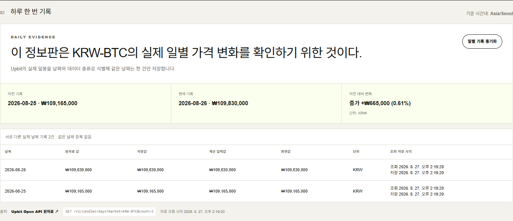
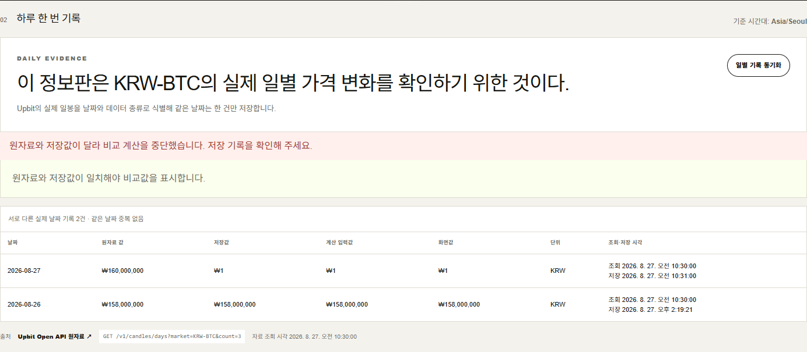
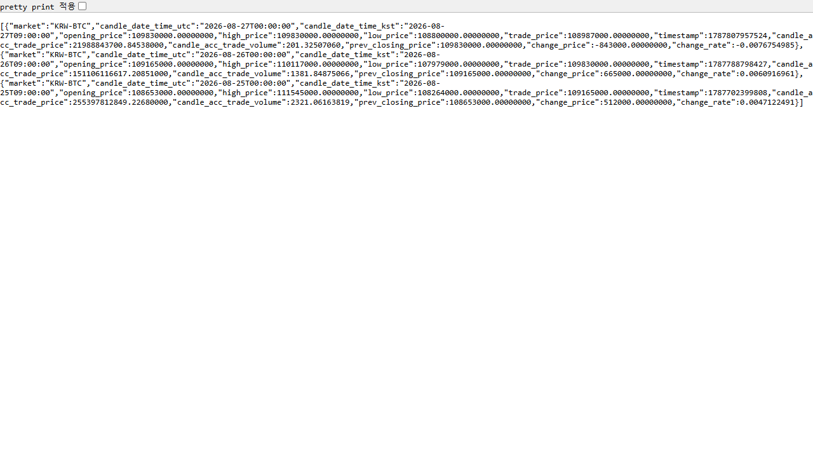
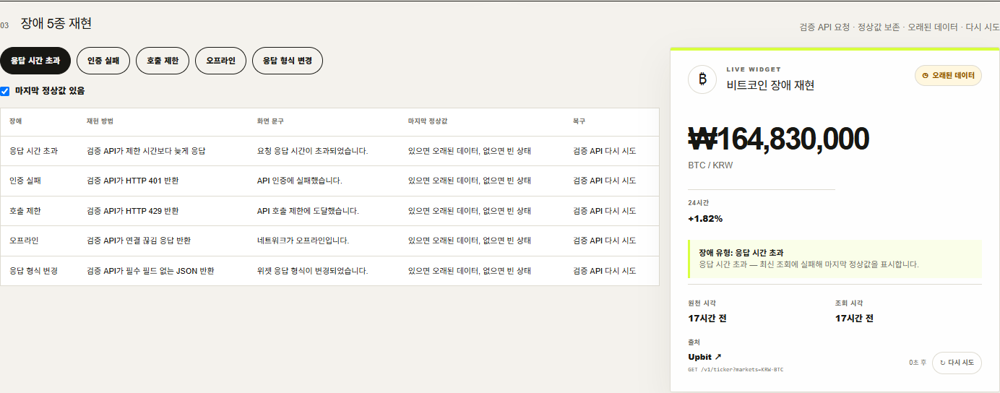
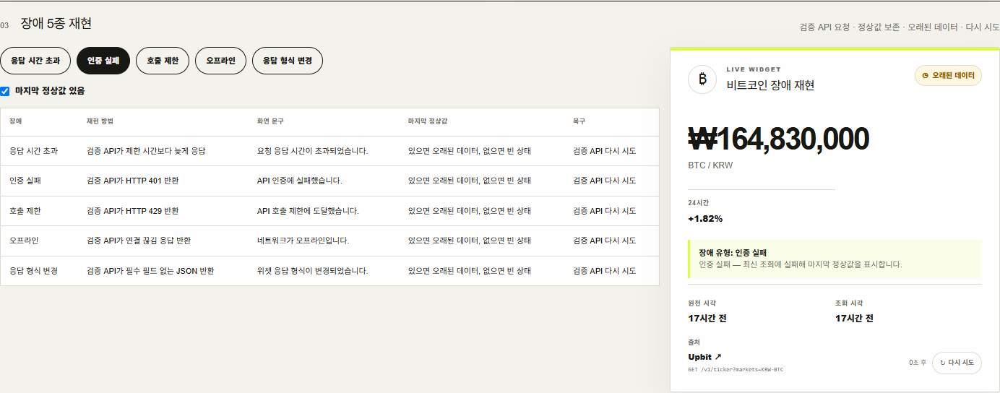
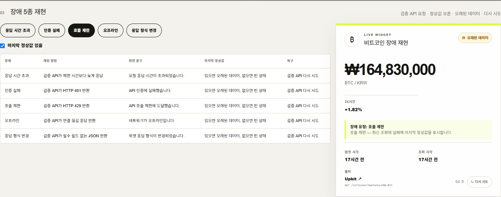
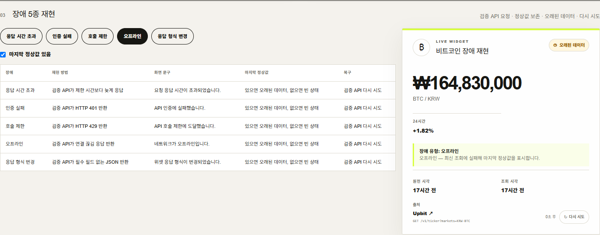
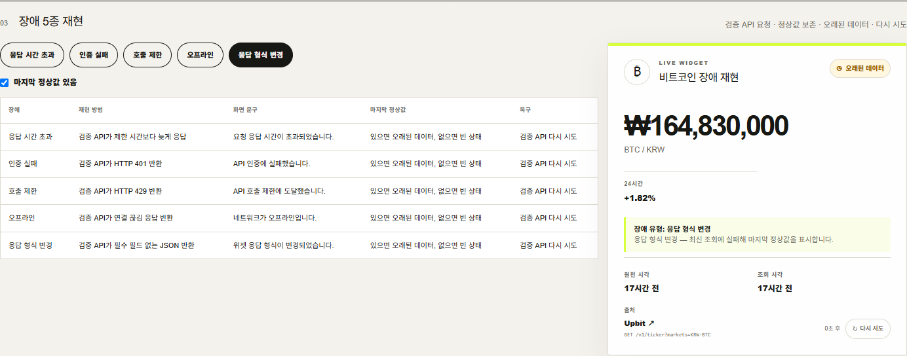
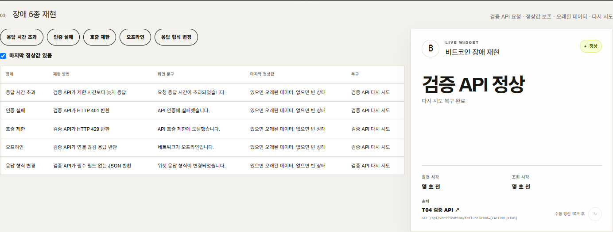

# T04 프로젝트 전체 기록

이 문서는 GitHub 저장소에서 발표와 검토에 사용하는 통합 Markdown 원고다. 구현 문서, 검증 문서, 작업 기록, 배포 기록의 핵심 내용을 한 곳에 모으고, 원문과 스크린샷 증거를 연결한다.

## 1. 프로젝트 개요

오늘의 진짜 정보판은 실제로 변하는 공개 데이터 하나를 값·단위·출처·원천 시각·조회 시각·기준 시간대와 함께 보여준다. 데이터가 오지 않을 때는 마지막 정상값을 지우지 않고 오래된 데이터임을 표시하며, 정상값이 한 번도 없으면 빈 상태를 표시한다.

- 데이터: Upbit BTC/KRW 일봉
- 공개 원천: `https://api.upbit.com/v1/candles/days?market=KRW-BTC&count=3`
- 기준 시간대: Asia/Seoul
- 일별 키: `upbit:KRW-BTC:YYYY-MM-DD`
- 공개 결과: <https://realtime-info-board-t04.vercel.app/>
- 장애 검증: <https://realtime-info-board-t04.vercel.app/verification>
- 소스: <https://github.com/stulss/realtime-info-board-t04>

## 2. 요구사항과 판정

변경된 T04-C01~C28의 상태는 [요구사항 매핑](00_과제_요구사항_매핑.md)에 기록했다. 로컬 기능은 대부분 완료했으며, 실제 다음 KST 날짜 재실행과 제공되지 않은 asset 패키지 해시는 보류로 정직하게 표시했다.

### 카드 1 — 값의 맥락

BTC/KRW 값, KRW 단위, Upbit 링크, 원천 관측 시각, 조회 시각, Asia/Seoul를 한 화면에 표시한다. 정상 응답의 원천값·저장값·화면값을 대조한다.

### 카드 2 — 비밀 없는 호출

브라우저가 외부 API를 직접 호출하지 않고 서버 Route Handler가 호출한다. 소스·배포 파일·네트워크 요청·Git 기록의 비밀값 검색 결과는 0건이다.

### 카드 3 — 다섯 가지 실패

timeout, 401/403, 429 호출 제한, offline, schema 변경을 합성 API로 재생한다. 오류 종류별 문구와 `error kind`, 마지막 정상값/오래된 데이터, 빈 상태, 다시 시도 동작을 구분한다.

### 카드 4 — 하루 한 줄

Asia/Seoul 날짜를 고유키로 사용한다. 같은 날짜의 재실행은 병합되어 한 행만 남고, 다른 날짜는 별도 행이 된다. 실제 원천 완료 일봉 두 건은 확보했지만 앱을 서로 다른 실제 날짜에 직접 재실행하는 최종 증거는 보류 중이다.

### 카드 5 — 어제와 비교

원천·저장·계산 입력·화면값을 나란히 대조하고, 날짜순으로 차이와 방향을 계산한다.

| 날짜 | 원천 | 저장 | 계산 입력 | 화면 | 단위 |
|---|---:|---:|---:|---:|---|
| 2026-08-25 | 109,165,000 | 109,165,000 | 109,165,000 | 109,165,000 | KRW |
| 2026-08-26 | 109,830,000 | 109,830,000 | 109,830,000 | 109,830,000 | KRW |

`109,830,000 - 109,165,000 = +665,000 KRW`, 변화율은 `0.6091…% → 0.61%`이다.

## 3. 구현 기록

- `src/app/api/widgets/*`: 서버 데이터 Route Handler
- `src/app/api/verification/failure`: 합성 장애 검증 API
- `src/lib/providers`: Upbit 및 기존 provider adapter와 응답 스키마 검증
- `src/lib/client/widget-state.ts`: timeout/HTTP/offline/schema 분류와 stale/empty fallback
- `src/lib/history/daily-records.ts`: KST 날짜 키, 중복 병합, 변화 계산
- `src/components/daily-history-panel.tsx`: 일별 표와 원천·저장·계산·화면 대조
- `src/components/failure-verification.tsx`: 다섯 장애 재생과 복구 UI
- `tests/e2e/dashboard.spec.ts`: 공개 화면·소스 링크·비밀값·장애·날짜 중복 E2E

원문 문서: [기획](01_기획.md), [배포](05_배포.md), [트러블슈팅](트러블슈팅.md), [작업내역](../작업내역_체크리스트.md), [사용자 사전작업](사용자_사전작업_체크리스트.md).

## 4. 검증 방법

```bash
npm run lint
npm run typecheck
npm test
npm run build
npm run test:e2e
```

최근 결과는 lint, typecheck, Vitest 41개, production build, Playwright E2E 9개 통과다.

## 5. 스크린샷 증거

최신 전체 E2E 세트는 [2026-08-27T05-19-10-578Z](검증스크린샷/2026-08-27T05-19-10-578Z/)이며 기존 폴더와 파일을 덮어쓰지 않는다.

### 정상 화면과 날짜 대조





### 출처 링크와 장애 재생















스크린샷별 SHA-256은 같은 폴더의 `SHA256.txt`에 있다. 전체 실행 이력은 [스크린샷 README](검증스크린샷/README.md)에 있다.

## 6. 문서 전체 색인

| 문서 | 역할 |
|---|---|
| `README.md` | GitHub 첫 화면용 요약·실행·검증 |
| `계획.md` | 단계별 구현 계획 |
| `작업내역_체크리스트.md` | 작업 로그와 판단 기록 |
| `docs/00_과제_요구사항_매핑.md` | C01~C28 판정 |
| `docs/01_기획.md` | 제품 목적과 구조 |
| `docs/05_배포.md` | 배포 및 운영 메모 |
| `docs/T04_검증_체크리스트.md` | 카드별 검증과 미완료 조건 |
| `docs/검증안내서.md` | 3단계 확인 방법과 문제 해결 |
| `docs/AI_3줄.md` | AI 위임·직접 판단·불채택 판단 |
| `docs/트러블슈팅.md` | 실패 원인과 대응 기록 |
| `docs/사용자_사전작업_체크리스트.md` | 공개 심사 전 점검 |
| `docs/포트폴리오_추가용_소개글.md` | 프로젝트 소개 문안 |
| `docs/검증스크린샷/` | 실행별 PNG, 로그, 해시 증거 |

## 7. 발표 시 남은 확인

공개 주소는 배포 완료되었다. 다만 C19/C21/C22의 실제 다음 KST 날짜 앱 재실행과 외부 asset 패키지 해시는 아직 보류다. 이 문서는 완료와 보류를 구분해 기록하며, 합성 fixture를 실제 날짜 기록으로 바꾸어 쓰지 않는다.
